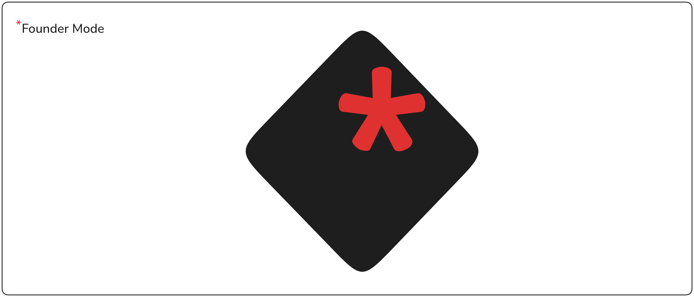

# \*Founder Mode

A Chrome extension that blocks distracting websites so you can stay focused and get things done.

## What it does

- Block any URL pattern (e.g. `youtube.com/shorts/*`, `facebook.com/*`)
- Redirects blocked pages to a clean blocked screen
- Intercepts SPA navigation (no refresh needed on sites like YouTube or Facebook)
- Friction flow before unblocking — makes you think twice before removing a URL

## Usage

1. Click the extension icon to open the popup
2. Click **Manage URLs** to open the options page
3. Enter a URL pattern to block (e.g. `youtube.com/shorts/*`) and press **+** or Enter
4. To remove a blocked URL, click **Remove URL** — you'll go through a short friction flow first

## URL Pattern Examples

| Pattern | Blocks |
|---|---|
| `facebook.com/*` | All of Facebook |
| `youtube.com/shorts/*` | YouTube Shorts only |
| `twitter.com/*` | All of Twitter/X |
| `reddit.com/r/*/new/*` | Specific subreddit feeds |

## Install

Get it from the [Chrome Web Store](https://chromewebstore.google.com) — search for **Founder Mode**.

Or build it yourself:

1. Clone the repo and install dependencies:

```bash
npm install
```

2. Start the development server:

```bash
npm run dev
```

3. Go to `chrome://extensions/`, enable **Developer mode**, click **Load unpacked**, and select the `dist` folder.

4. Build for production:

```bash
npm run build
```

The packaged `.zip` will be output to the `release/` folder.
